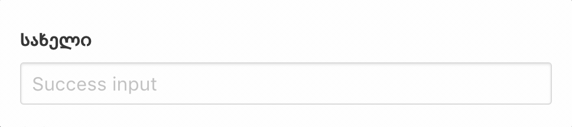

# vue.js-georgian-keyboard
### Georgian Keyboard for Vue.js

#### Install
include into your html file
```html
<script src="https://cdn.rawgit.com/shakogegia/vue.js-georgian-keyboard/master/vuejs_georgian_keyboard.js"></script>
```

#### Usage
use it like
```html
<input type="text" v-georgian>
```

#### Demo
